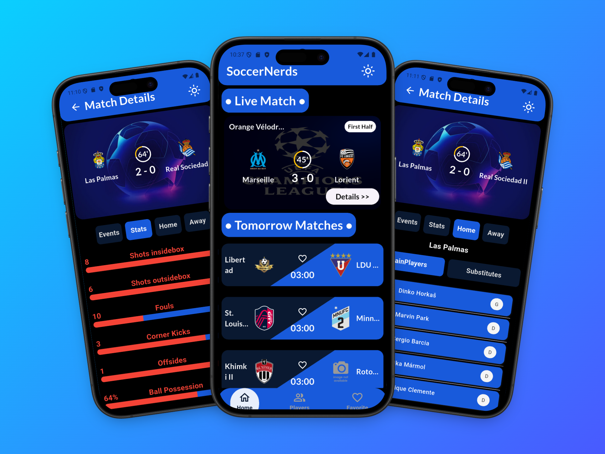
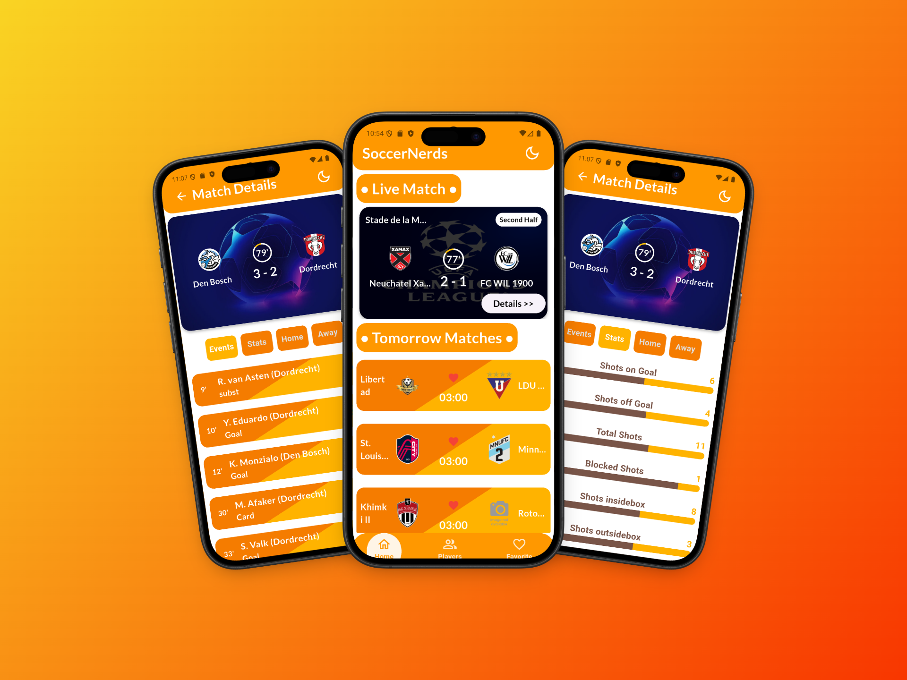

<div align="center">

# ⚽ SoccerNerds

### Your intelligent football companion — live scores, match analytics, player profiles, and AI-powered match insights.

[](https://flutter.dev)
[](https://dart.dev)
[](https://bloclibrary.dev)
[](https://www.api-football.com/)
[](https://ai.google.dev/)

</div>

---

## 📸 Screenshots

<div align="center">

### 🌑 Dark Mode



> _Match Details · Live Match · Match Statistics — Dark Blue & Black palette_

---

### ☀️ Light Mode



> _Match Details · Live Match · Match Statistics — Orange & Amber palette_

</div>

---

## 📖 Overview

**SoccerNerds** is a fully-featured, production-ready Flutter football application that gives football fans everything they need in one place. It pulls real-time data from the **API-Football v3** (via RapidAPI) to surface live match scores, upcoming fixtures, match events, team lineups, in-depth statistics, and detailed player profiles.

What makes SoccerNerds stand out is its built-in **AI Match Analyst** powered by **Google Gemini 2.5 Flash** — users can tap a button on any live match and receive a concise, professional football analysis generated from the actual match events and team statistics.

The app targets football enthusiasts who want more than just a score ticker: deep stats, roster breakdowns, and AI-driven narrative all in one polished, dual-theme mobile experience.

---

## ✨ Features

> All features listed below are **implemented and verified** from the source code.

### 🏠 Home — Live & Upcoming Matches

- **Live match feed** — fetches all currently in-progress fixtures globally via `GET /fixtures?live=all`
- **Tomorrow's matches** — fetches the next day's scheduled fixtures via `GET /fixtures?date=<date>`
- Real-time match cards showing home/away team logos, current score, match minute, venue, and competition badge
- Heart/favourite toggle button directly on each upcoming match card
- Tap any live match card to navigate to the full **Match Details** screen

### 🔍 Match Details Screen

- **Circular progress timer** visualising elapsed minutes out of 90 (with "Ended" state for finished matches)
- **Four tabbed sub-screens** navigated via a `PageView` with smooth animated transitions:

| Tab        | Content                                                                                            |
| ---------- | -------------------------------------------------------------------------------------------------- |
| **Events** | Chronological list of all match events (goals, cards, substitutions) with type-specific icons      |
| **Stats**  | Side-by-side bar comparisons for all official statistics (shots, fouls, corners, possession, etc.) |
| **Home**   | Starting XI + substitutes roster for the home team                                                 |
| **Away**   | Starting XI + substitutes roster for the away team                                                 |

- Dynamic tab labels — gracefully degrades to `['Events', 'Stats', 'Teams']` when lineup data is unavailable

### 🤖 AI Match Analyst

- One-tap **Gemini 2.5 Flash** analysis via the `AI Analyst >>` button on every match detail screen
- Builds a structured prompt from live match events + team statistics and sends it to the Gemini API
- Displays the AI-generated analysis on a dedicated dark-themed `AiPreview` screen
- **Copy to clipboard** button on the analysis screen for easy sharing
- Graceful loading snackbar informs users while the AI processes the request

### 📊 Match Statistics

- Per-stat visual progress bar split between home (accent colour) and away (secondary colour) sides
- Handles both numeric and percentage-type stat values with null-safety
- Responsive list with theme-aware colours

### 🧑‍🤝‍🧑 Team Lineups

- Main XI and Substitutes selectable via toggle buttons
- Each player card shows jersey number, full name, and position abbreviation
- Handles missing lineup data gracefully

### 👤 Player Profiles

- **Paginated player browser** — 3 pages of player cards swipeable via a `PageView` with a custom `SmoothPageIndicator`
- Each card shows: name, age, nationality, position, and jersey number with a `CachedNetworkImage` photo
- Shimmer placeholder loading effect while images load
- **Hero animation** transition between the player list card and the details screen

### 👤 Player Details Screen

- Expandable `SliverAppBar` with the player's photo as a parallax hero background
- Displays full player bio and season statistics via reusable `BuildInfoRow` and `BuildKeyStatsSection` components

### 🔎 Global Player Search

- System `SearchDelegate` accessible from the app bar on every screen
- **Debounced search** (500 ms timer) to avoid excessive API calls while typing
- Live results showing photo, name, and nationality; tap any result to navigate directly to that player's details

### ❤️ Favourites

- Toggle any upcoming match as a favourite directly from the match list
- Favourites persist across app restarts via **SharedPreferences** (JSON-serialized match objects)
- Dedicated **Favourites tab** lists all saved matches with home/away logos and a delete button

### 🌗 Dual Theme (Dark & Light)

- **Dark Mode** — deep navy (`#0A1931`) + royal blue (`#185ADB`) palette
- **Light Mode** — vibrant orange + amber palette
- Theme preference persisted in SharedPreferences and restored on next launch
- Toggled via a sun/moon icon button in the app bar, available from every screen

### 🎬 Splash & Onboarding

- 3-second animated **Splash Screen** with an SVG app icon and "Soccer Nerds" branding
- **3-page Onboarding** flow with SVG illustrations, a `SmoothPageIndicator`, skip support, and forward/back navigation

---

## 🛠 Tech Stack

| Category                   | Technology                                     |
| -------------------------- | ---------------------------------------------- |
| **Framework**              | Flutter 3.x                                    |
| **Language**               | Dart 3.7.2                                     |
| **State Management**       | BLoC / flutter_bloc                            |
| **Dependency Injection**   | GetIt (service locator pattern)                |
| **HTTP Client**            | Dio                                            |
| **Functional Programming** | Dartz (`Either` for error/success)             |
| **Local Storage**          | SharedPreferences (via `CacheHelper` wrapper)  |
| **Image Caching**          | cached_network_image                           |
| **AI Integration**         | Google Generative AI SDK (Gemini 2.5 Flash)    |
| **Fonts**                  | Google Fonts (Lato, Oswald) + bundled Lato TTF |
| **Animations**             | animate_do, shimmer, smooth_page_indicator     |
| **SVG Rendering**          | flutter_svg                                    |
| **Carousel**               | carousel_slider                                |
| **Environment Config**     | flutter_dotenv                                 |
| **Data Equality**          | Equatable                                      |
| **Football Data API**      | API-Football v3 (RapidAPI)                     |

---

## 🏗 Architecture

SoccerNerds follows **Clean Architecture** with a strict **Feature-First** folder structure. Each feature is fully self-contained, divided into three layers:

```
Feature
├── data/          ← Models, remote data sources, repository implementations
├── domain/        ← Entities, abstract repository interfaces, use cases
└── presentation/  ← BLoC (event/state/bloc), screens, components, widgets
```

### Data Flow

```
UI (Screen / Widget)
    │ dispatches Event
    ▼
BLoC (Presentation Layer)
    │ calls Use Case
    ▼
Use Case (Domain Layer)
    │ calls abstract Repository interface
    ▼
Repository Implementation (Data Layer)
    │ calls Remote Data Source
    ▼
Remote Data Source  ──►  Dio  ──►  API-Football / Gemini
    │ returns Model or throws ServerException
    ▼
Repository maps to Either<Failure, Entity>
    ▼
BLoC emits new State
    ▼
UI rebuilds via BlocBuilder
```

### Key Design Patterns

- **Repository Pattern** — abstract interfaces in domain, concrete implementations in data
- **Use Case Pattern** — one class per discrete operation, encapsulating all business logic
- **Service Locator (GetIt)** — all BLoCs, use cases, repositories, and services are registered and resolved lazily
- **BLoC Pattern** — strict unidirectional data flow: Events → BLoC → States
- **Functional Error Handling** — `dartz`'s `Either<Failure, T>` eliminates exception propagation into the UI layer
- **Custom Theme Extensions** — `AngledCardTheme` extends Flutter's `ThemeExtension<T>` to expose feature-specific colour tokens that respond to theme switching

---

## 📁 Project Structure

```
football_app/
├── lib/
│   ├── main.dart                        # App entry point, DI init, BLoC providers
│   │
│   ├── core/
│   │   ├── error/                       # Failure & Exception classes
│   │   ├── network/
│   │   │   ├── local/
│   │   │   │   └── cache_helper.dart    # SharedPreferences wrapper
│   │   │   └── error_message_model.dart
│   │   ├── services/
│   │   │   └── service_locator.dart     # GetIt DI registration
│   │   ├── theme/
│   │   │   ├── controller/              # ThemeBloc (event, state, bloc)
│   │   │   └── theme_mode.dart          # getDarkMode(), getLightMode(), AngledCardTheme
│   │   ├── usecase/
│   │   │   └── base_usecase.dart        # Abstract UseCase<Type, Params>
│   │   └── utils/
│   │       ├── api_constant.dart        # All API endpoint builders
│   │       ├── dio_config.dart          # Singleton Dio instance
│   │       └── enums.dart              # RequestState enum (loading/success/error)
│   │
│   └── features/
│       ├── splash/                      # Splash screen (SVG logo, 3 s timer)
│       ├── onboarding/                  # 3-page onboarding with SVG illustrations
│       ├── home/                        # Bottom nav shell (Home, Players, Favourites)
│       │   └── presentation/
│       │       ├── controller/          # HomeBloc — manages active nav tab index
│       │       ├── screen/             # HomeScreen (BottomNav + CustomAppBar shell)
│       │       └── component/model/    # navItems list (NavModel)
│       │
│       ├── list_of_match/              # Core match feature (full Clean Architecture)
│       │   ├── data/
│       │   │   ├── datasource/         # MatchRemoteDataSource (all Dio calls)
│       │   │   ├── model/             # LiveMatchModel, MatchStatisticsModel, TeamFormModel, etc.
│       │   │   └── repo/             # MatchRepo implementation
│       │   ├── domain/
│       │   │   ├── entity/           # LiveMatch, LiveMatchDetails, MatchStatistics, TeamForm
│       │   │   ├── repo/             # BaseMatchRepo interface
│       │   │   └── usecase/          # GetLiveMatch, GetUpcomingMatch, GetMatchDetails, GetTeamForm, GetMatchStatistics
│       │   └── presentation/
│       │       ├── controller/       # MatchBloc, LiveMatchDetailsBloc
│       │       ├── screen/           # MatchScreen, LiveMatchDetailsScreen, StatisticsScreen, TeamFormScreen
│       │       └── component/        # LiveMatchComponent, UpcomingMatchComponent, DetailsOfCarousel
│       │                               # CustomAppBar, CustomSearchDelegate
│       │
│       ├── ai/                         # Gemini AI integration
│       │   ├── service/               # AiAnalystService (prompt builder + Gemini SDK call)
│       │   └── presentation/screen/   # AiPreview (analysis display + copy to clipboard)
│       │
│       ├── favorite/                   # Persistent favourites
│       │   ├── services/              # FavoriteService (SharedPreferences CRUD)
│       │   └── presentation/screen/   # FavoriteScreen
│       │
│       └── player_profile/            # Player browser & detail view
│           ├── data/
│           │   ├── datasource/        # PlayerProfileRemoteDataSource
│           │   └── model/            # PlayerProfileModel, PlayerDetailsModel
│           ├── domain/
│           │   ├── entity/           # PlayerProfile, PlayerDetails
│           │   └── usecase/          # GetPlayerProfile, GetPlayerDetails, GetPlayerProfileSearch
│           └── presentation/
│               ├── controller/       # PlayerProfileBloc
│               ├── screen/           # PlayerProfileScreen, PlayerDetailsScreen
│               └── component/        # BuildInfoRow, BuildKeyStatsSection
│
├── assets/
│   ├── images/                        # splash_icon.svg, boarding1.svg, boarding2.svg, boarding3.svg
│   └── fonts/                         # Lato-Bold.ttf, Lato-Regular.ttf
│
├── .env                               # API keys (API-Football + Gemini) — NOT committed
└── pubspec.yaml
```

---

## 📦 Key Packages

| Package                 | Version  | Purpose                                              |
| ----------------------- | -------- | ---------------------------------------------------- |
| `flutter_bloc`          | ^9.1.1   | BLoC state management pattern                        |
| `bloc`                  | ^9.0.0   | Core BLoC logic primitives                           |
| `get_it`                | ^8.2.0   | Service locator / dependency injection               |
| `dio`                   | ^5.8.0+1 | HTTP client for all REST API calls                   |
| `dartz`                 | ^0.10.1  | Functional `Either` type for clean error handling    |
| `equatable`             | ^2.0.7   | Value equality for BLoC states and events            |
| `google_generative_ai`  | ^0.4.7   | Google Gemini AI SDK for match analysis              |
| `flutter_dotenv`        | ^6.0.0   | Loads `.env` file for API key management             |
| `shared_preferences`    | ^2.5.3   | Persists theme preference and favourites             |
| `cached_network_image`  | ^3.4.1   | Efficient network image loading with disk cache      |
| `shimmer`               | ^3.0.0   | Skeleton loading placeholder animation               |
| `google_fonts`          | ^6.3.0   | Lato and Oswald font families                        |
| `smooth_page_indicator` | ^1.2.1   | Animated page dots for onboarding and player browser |
| `animate_do`            | ^4.2.0   | Entry animations                                     |
| `carousel_slider`       | ^5.1.1   | Carousel widget                                      |
| `flutter_svg`           | ^2.2.0   | Renders SVG splash icon and onboarding illustrations |
| `intl`                  | ^0.20.2  | Date formatting utilities                            |

---

## ⚙️ How It Works

### App Initialisation (`main.dart`)

1. `DioConfig.init()` creates a singleton `Dio` instance pre-configured with the API-Football base URL and RapidAPI auth headers loaded from `.env`
2. `CacheHelper.init()` boots SharedPreferences
3. `ServiceLocator().init()` registers all BLoCs, use cases, repositories, data sources, and services into `GetIt`
4. `dotenv.load()` makes `.env` variables available at runtime
5. `FavoriteService.init()` deserialises saved favourites from SharedPreferences into memory
6. The persisted `isDark` flag is read and injected into the initial `ThemeBloc` state

### Navigation Flow

```
SplashScreen (3 s)
  └── OnboardingScreen (3 swipeable pages, skip-able)
        └── HomeScreen  (bottom navigation shell)
              ├── Tab 0: MatchScreen
              │     ├── LiveMatchComponent    (live fixtures)
              │     └── UpcomingMatchComponent (tomorrow's fixtures)
              │           └── Tap match → LiveMatchDetailsScreen
              │                 ├── Events tab   (match timeline)
              │                 ├── Stats tab    (StatisticsScreen)
              │                 ├── Home tab     (TeamFormScreen)
              │                 └── Away tab     (TeamFormScreen)
              │                       └── AI Analyst >> → AiPreview
              ├── Tab 1: PlayerProfileScreen  (paginated, 3 pages)
              │     └── Tap player → PlayerDetailsScreen
              └── Tab 2: FavoriteScreen  (persisted favourite matches)
```

### AI Analysis Flow

When the user taps **AI Analyst >>**:

1. `GetAiMatchPreviewEvent` is dispatched to `LiveMatchDetailsBloc`
2. The bloc calls `AiAnalystService.analyzeMatch(events, stats)`
3. The service formats a structured analyst prompt including all match events and both teams' statistics
4. The Gemini 2.5 Flash model returns a text analysis
5. The result is stored in bloc state and the user navigates to `AiPreview`
6. `AiPreview` renders the text with a one-tap copy-to-clipboard action

### Player Search Flow

From any screen's app bar search icon (`CustomSearchDelegate`):

1. Fires `GetPlayerProfileSearchEvent` with a **500 ms debounce** on each keystroke
2. `PlayerProfileBloc` calls `GetPlayerProfileSearchUseCase` → `GET /players/profiles?search=<name>`
3. Results render live; tapping a result triggers `GetPlayerDetailsEvent` and navigates to `PlayerDetailsScreen`

---

## 🚀 Installation & Setup

### Prerequisites

- [Flutter SDK](https://docs.flutter.dev/get-started/install) **3.7.2+**
- An **API-Football** key from [RapidAPI](https://rapidapi.com/api-sports/api/api-football)
- A **Google Gemini API** key from [Google AI Studio](https://aistudio.google.com/app/apikey)
- A connected Android/iOS device or emulator

### Steps

```bash
# 1. Clone the repository
git clone https://github.com/your-username/football_app.git
cd football_app

# 2. Install dependencies
flutter pub get

# 3. Configure environment variables
# Create a .env file in the project root with the following content:
#
#   apiKey = "YOUR_API_FOOTBALL_RAPIDAPI_KEY"
#   aiApitKey = "YOUR_GOOGLE_GEMINI_API_KEY"

# 4. Run the application
flutter run
```

### Build for Release

```bash
# Android APK
flutter build apk --release

# Android App Bundle (for Play Store)
flutter build appbundle --release

# iOS
flutter build ios --release
```

---

## 🌐 API Reference

All match data is sourced from [API-Football v3](https://www.api-football.com/documentation-v3) via RapidAPI.

| Endpoint                                | Purpose                                    |
| --------------------------------------- | ------------------------------------------ |
| `GET /fixtures?live=all`                | All currently live fixtures                |
| `GET /fixtures?date=YYYY-MM-DD`         | Fixtures scheduled for a given date        |
| `GET /fixtures/events?fixture=<id>`     | Match events (goals, cards, substitutions) |
| `GET /fixtures/lineups?fixture=<id>`    | Team lineups / starting XI and substitutes |
| `GET /fixtures/statistics?fixture=<id>` | In-match team statistics                   |
| `GET /players/profiles?page=<n>`        | Paginated global player profiles           |
| `GET /players?id=<id>&season=2023`      | Full player details + season stats         |
| `GET /players/profiles?search=<name>`   | Player name search                         |

AI analysis uses the **Google Gemini 2.5 Flash** model via the official `google_generative_ai` Dart SDK.

---

## 🤝 Contributing

1. Fork the repository
2. Create a feature branch: `git checkout -b feature/your-feature-name`
3. Commit your changes following [Conventional Commits](https://www.conventionalcommits.org/): `git commit -m 'feat: add your feature'`
4. Push to the branch: `git push origin feature/your-feature-name`
5. Open a Pull Request

---

<div align="center">

Made with Mahmoud Magdy

</div>
